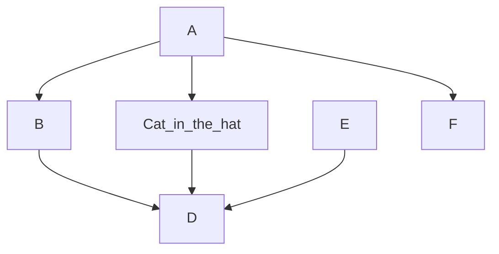
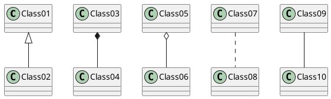
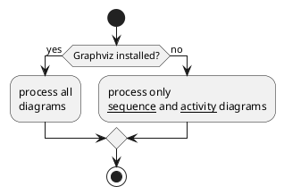
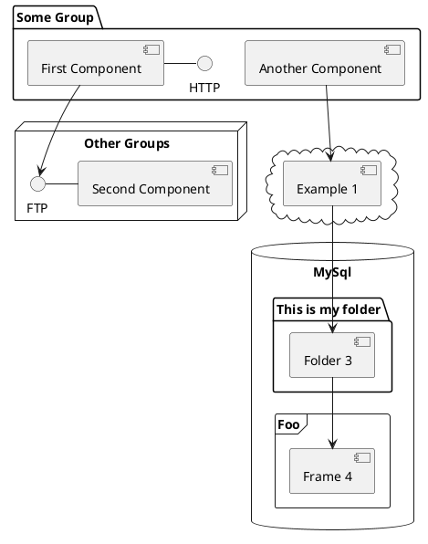
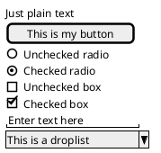
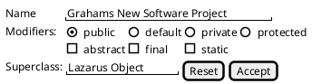
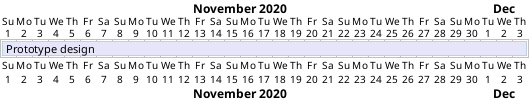
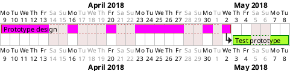

# My first Markdown page

## by Graham Ward



$$ c^2 + {d^{23}/23-f^{16}} $$

$$ a^2 = b^2 + c^2 $$

$$ \sum_{i=1}^{10} t_i $$

**and what about this?**

```wavedrom
{signal: [
    {wave: '01010101010101'}, // toggling
    {wave: '0.1.0.hl'},       // dot(.) holds a value, h/l for high and low
    {wave: '222xxx345.6789'}, // multi-bit, X, 345 = colors, 6789 == x
    {wave:''}, // blank line
    
    // text
    {wave: '2.2.2.2.2.2.2.',
    data:["abcdefg","hijk","lmnop","qrs","tuv","wx","yz"]},
    {wave:''},
     
    // names and clocks
    {name: "posclk", wave: 'pPp...........' }, // capital letters for arrows
    {name: "negclk", wave: 'n.N..n........' },
    {name: "divclk", wave: 'lplpl.h.l.h.pl' },  {wave:''},
     
    // fun
    {name: "Barak",  wave: '01.zx=ud.23.45'},
     
    // gaps
    {name: "gaps",   wave: '01|022|0|x|.22' },
     
    // arrows with nodes and edges
    {name: "arrows", wave: '0n0....2..x2..',
     node: '.a.........d' },
      {wave: '1.0.10..x0....',
      node: '....b...c'}
      ],
      
    edge:['a~>b glitch',
    'c<~>d I found the bug!'
    ]
    }
```

 ```ditaa {cmd=true args=["-E"]} 
  +--------+   +-------+    +-------+
  |        |---+ ditaa +--->|       |
  |  Text  |   +-------+    |diagram|
  |Document|   |!magic!|    |       |
  |     {d}|   |       |    |       |
  +---+----+   +-------+    +-------+
      :                         ^
      |       Lots of work      |
      +-------------------------+
  ```

I used the Markdown shortcut available in right-click menu (Add Table with Header) to create the following table:

1 | 2 | 3
--|---|--
A | B | C
5 | 6 | 7
8 | 9 | 10

**PlantUML**
PlantUML provides a wide range of different graph and diagram options:







#### Another good graphical option for (wireframe) user interface design





### Gannt chart examples (though they need a little work)





### And here's a (VEGA) pie chart

```vega align="center"
{
  "$schema": "https://vega.github.io/schema/vega/v5.json",
  "width": 200,
  "height": 200,
  "autosize": "none",

  "signals": [
    {
      "name": "startAngle", "value": 0,
      "bind": {"input": "range", "min": 0, "max": 6.29, "step": 0.01}
    },
    {
      "name": "endAngle", "value": 12.29,
      "bind": {"input": "range", "min": 0, "max": 6.29, "step": 0.01}
    },
    {
      "name": "padAngle", "value": 0,
      "bind": {"input": "range", "min": 0, "max": 0.1}
    },
    {
      "name": "innerRadius", "value": 0,
      "bind": {"input": "range", "min": 0, "max": 90, "step": 1}
    },
    {
      "name": "cornerRadius", "value": 0,
      "bind": {"input": "range", "min": 0, "max": 10, "step": 0.5}
    },
    {
      "name": "sort", "value": false,
      "bind": {"input": "checkbox"}
    }
  ],

  "data": [
    {
      "name": "table",
      "values": [
        {"id": 1, "field": 4},
        {"id": 2, "field": 6},
        {"id": 3, "field": 10},
        {"id": 4, "field": 3},
        {"id": 5, "field": 7},
        {"id": 6, "field": 8}
      ],
      "transform": [
        {
          "type": "pie",
          "field": "field",
          "startAngle": {"signal": "startAngle"},
          "endAngle": {"signal": "endAngle"},
          "sort": {"signal": "sort"}
        }
      ]
    }
  ],

  "scales": [
    {
      "name": "color",
      "type": "ordinal",
      "domain": {"data": "table", "field": "id"},
      "range": {"scheme": "category20"}
    }
  ],

  "marks": [
    {
      "type": "arc",
      "from": {"data": "table"},
      "encode": {
        "enter": {
          "fill": {"scale": "color", "field": "id"},
          "x": {"signal": "width / 2"},
          "y": {"signal": "height / 2"}
        },
        "update": {
          "startAngle": {"field": "startAngle"},
          "endAngle": {"field": "endAngle"},
          "padAngle": {"signal": "padAngle"},
          "innerRadius": {"signal": "innerRadius"},
          "outerRadius": {"signal": "width / 2"},
          "cornerRadius": {"signal": "cornerRadius"}
        }
      }
    }
  ]
}
```

### Time for a (VEGA) bar graph

```vega align="center"
{
  "$schema": "https://vega.github.io/schema/vega/v5.json",
  "width": 400,
  "height": 200,
  "padding": 5,

  "data": [
    {
      "name": "table",
      "values": [
        {"category": "A", "amount": 2},
        {"category": "B", "amount": 55},
        {"category": "C", "amount": 43},
        {"category": "D", "amount": 91},
        {"category": "E", "amount": 81},
        {"category": "F", "amount": 53},
        {"category": "G", "amount": 19},
        {"category": "H", "amount": 87}
      ]
    }
  ],

  "signals": [
    {
      "name": "tooltip",
      "value": {},
      "on": [
        {"events": "rect:mouseover", "update": "datum"},
        {"events": "rect:mouseout",  "update": "{}"}
      ]
    }
  ],

  "scales": [
    {
      "name": "xscale",
      "type": "band",
      "domain": {"data": "table", "field": "category"},
      "range": "width",
      "padding": 0.05,
      "round": true
    },
    {
      "name": "yscale",
      "domain": {"data": "table", "field": "amount"},
      "nice": true,
      "range": "height"
    }
  ],

  "axes": [
    { "orient": "bottom", "scale": "xscale" },
    { "orient": "left", "scale": "yscale" }
  ],

  "marks": [
    {
      "type": "rect",
      "from": {"data":"table"},
      "encode": {
        "enter": {
          "x": {"scale": "xscale", "field": "category"},
          "width": {"scale": "xscale", "band": 1},
          "y": {"scale": "yscale", "field": "amount"},
          "y2": {"scale": "yscale", "value": 0}
        },
        "update": {
          "fill": {"value": "steelblue"}
        },
        "hover": {
          "fill": {"value": "red"}
        }
      }
    },
    {
      "type": "text",
      "encode": {
        "enter": {
          "align": {"value": "center"},
          "baseline": {"value": "bottom"},
          "fill": {"value": "#333"}
        },
        "update": {
          "x": {"scale": "xscale", "signal": "tooltip.category", "band": 0.5},
          "y": {"scale": "yscale", "signal": "tooltip.amount", "offset": -2},
          "text": {"signal": "tooltip.amount"},
          "fillOpacity": [
            {"test": "datum === tooltip", "value": 0},
            {"value": 1}
          ]
        }
      }
    }
  ]
}
```

### and now this

!!! warning this admonishment is broken why does it not work! :(
